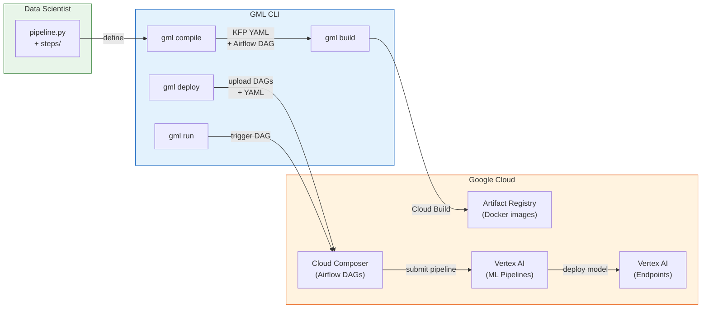
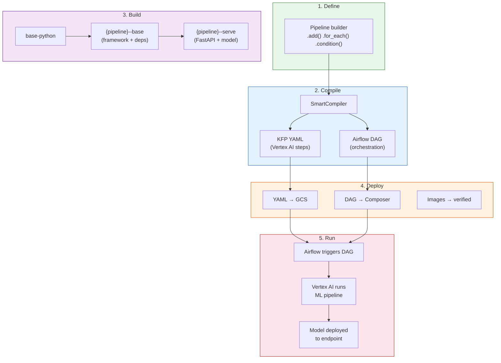
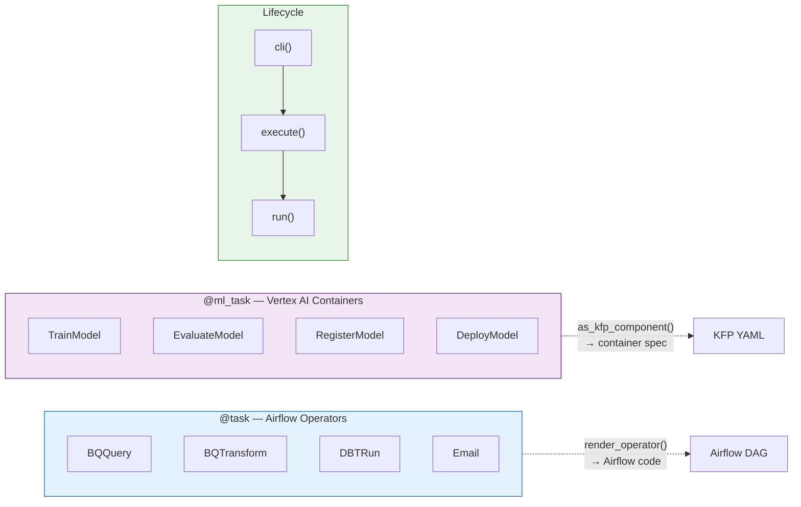
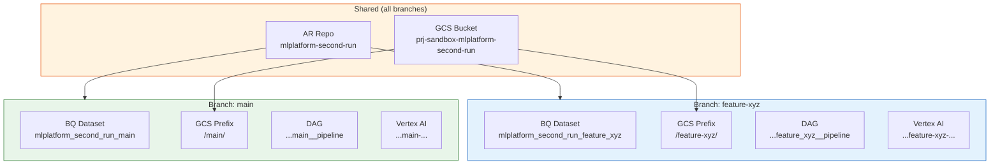

# GCP ML Framework (`gcp_ml_framework`)

A pip-installable ML platform framework where data scientists define pipelines with Python decorators (`@task`, `@ml_task`), write business logic in `run()` methods, and the framework handles compilation to KFP YAML, Airflow DAG generation, Docker image management, and deployment to Vertex AI via Cloud Composer.

## How It Works



Data scientists write pipeline definitions using the builder API:

```python
from gcp_ml_framework import Pipeline
from gcp_ml_framework.components.ml.register import RegisterModel
from gcp_ml_framework.components.ml.deploy import DeployModel
from my_project.steps.train_model import MyTrainStep

pipeline = (
    Pipeline(name="my_pipeline", schedule="@daily")
    .add(MyTrainStep(
        component_name="train",
        runtime_dockerfile="pipelines/my_pipeline/base.Dockerfile",
    ), name="Train Model")
    .add(RegisterModel(
        model_name="my-model",
        runtime_dockerfile="pipelines/my_pipeline/base.Dockerfile",
        serving_dockerfile="pipelines/my_pipeline/serve.Dockerfile",
    ), name="Register Model")
    .add(DeployModel(
        model_name="my-model",
        runtime_dockerfile="pipelines/my_pipeline/base.Dockerfile",
    ), name="Deploy Model")
    .build()
)
```

## Pipeline Lifecycle



## Component Model



## Quick Start

```bash
# Install
git clone <repo-url> && cd <repo>
uv sync

# Configure
cp .env.example .env
# Edit .env with your GCP project, team, service accounts

# Compile → Build → Deploy → Run
UV_ENV_FILE=.env uv run -- gml compile --all
UV_ENV_FILE=.env uv run -- gml build house_price
UV_ENV_FILE=.env uv run -- gml deploy --all
UV_ENV_FILE=.env uv run -- gml run house_price
```

See [docs/guides/quickstart.md](docs/guides/quickstart.md) for the full walkthrough.

## CLI

| Command | Description |
|---------|-------------|
| `gml compile [name \| --all]` | Compile pipeline(s) to KFP YAML + Airflow DAG |
| `gml build [name \| --all]` | Build Docker images via Cloud Build |
| `gml deploy [name \| --all]` | Deploy DAGs + YAMLs + verify images |
| `gml run [name] [--local]` | Trigger via Composer, or `--local` for in-process |
| `gml context show` | Show resolved config and resource names |
| `gml teardown [--branch]` | Delete ephemeral dev resources |

## Project Structure

```
gcp_ml_framework/          Framework library
├── cli/                     CLI commands (compile, build, deploy, run)
├── components/              BaseComponent + ML/operator/transformation components
├── pipeline/                Builder, SmartCompiler, PipelineCompiler, LocalRunner
├── config.py                FrameworkConfig + GCPConfig (pydantic-settings)
├── context.py               MLContext (immutable runtime context)
├── naming.py                NamingConvention (all GCP resource names)
└── decorators.py            @task and @ml_task decorators

pipelines/                 Pipeline definitions
├── house_price/             Reference implementation (train → register → deploy)
├── training_pipeline/       Full lifecycle (ingest → transform → train → eval → register → deploy)
└── verification_pipeline/   Exercises ALL capabilities (loops, conditions, monitoring)

app/                       Per-pipeline FastAPI serving apps
docker/                    Dockerfiles (base-python → pipeline--base → pipeline--serve)
second_run/                Shared business logic (estimators, feature engineering)
tests/                     Unit / integration / e2e test suite
```

## Branch Isolation

Every branch gets its own isolated GCP resources — no cross-contamination between developers.



## Configuration

All config via `.env` (gitignored). Key variables:

| Variable | Description | Example |
|----------|-------------|---------|
| `TEAM` | Team identifier | `mlplatform` |
| `PROJECT` | Project name | `second_run` |
| `ENVIRONMENT` | Runtime environment | `dev` |
| `GCP_PROJECT_ID` | GCP project | `prj-my-sandbox` |
| `GCP_REGION` | GCP region | `us-east4` |

All GCP resource names are derived from `{team}-{project}-{branch}` via `NamingConvention`. See [docs/operations/configuration.md](docs/operations/configuration.md).

## Development

```bash
# Unit tests (fast, no GCP)
uv run -- pytest tests/ -m unit -v

# Lint + type check
uv run -- ruff check gcp_ml_framework tests
uv run -- mypy gcp_ml_framework/
```

| Tier | Scope | GCP Required | Speed |
|------|-------|-------------|-------|
| Unit | Framework logic, mocked | No | <30s |
| Integration | Real BQ/GCS on dev | Yes | Minutes |
| E2E | Full pipeline on Vertex AI | Yes | 5-10 min |

## Documentation

| Section | What you'll find |
|---------|-----------------|
| [Architecture](docs/architecture/) | System design, component model, compilation, ADRs |
| [Guides](docs/guides/) | Quickstart, writing components, writing pipelines, deployment |
| [Operations](docs/operations/) | Cloud Build, configuration, GCP resources, platform guide, testing |
| [Reference](docs/reference/) | Requirements status |

## Stack

- **Language:** Python 3.12
- **Package manager:** uv (exclusively)
- **Orchestration:** KFP v2 on Vertex AI, triggered by Airflow (Cloud Composer)
- **Docker:** Per-pipeline images built via Google Cloud Build
- **Serving:** Per-pipeline FastAPI apps on Vertex AI endpoints
- **Testing:** pytest with three-tier strategy (unit/integration/e2e)
- **Logging:** loguru
