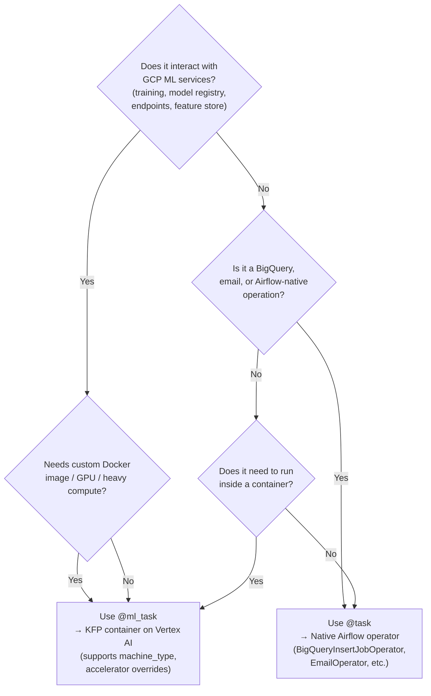
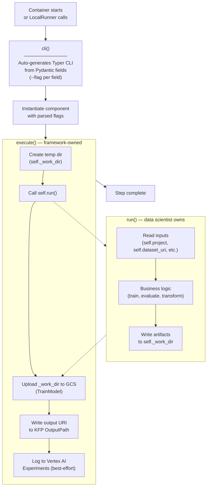

# Component Model

## Two Decorator Types

Every component is marked with one of two decorators that determine how it gets compiled:

| Decorator | `task_type` | Compilation target | Use cases |
|-----------|-------------|-------------------|-----------|
| `@task` | `TaskType.TASK` | Native Airflow operator (BigQueryInsertJobOperator, EmailOperator, etc.) | BQ queries, transforms, email notifications |
| `@ml_task` | `TaskType.ML_TASK` | KFP container component on Vertex AI | Training, evaluation, model registration, deployment |

```python
from gcp_ml_framework.decorators import task, ml_task

@task
class BQQuery(BaseComponent):
    """Compiled to BigQueryInsertJobOperator in the Airflow DAG."""
    ...

@ml_task
class TrainModel(BaseComponent):
    """Compiled to a KFP container_component running on Vertex AI."""
    ...
```

`@ml_task` optionally accepts resource overrides:

```python
@ml_task(machine_type="a2-highgpu-1g", accelerator_type="NVIDIA_TESLA_A100", accelerator_count=1)
class TrainLargeModel(BaseComponent):
    ...
```

These override the default `machine_type`, `accelerator_type`, and `accelerator_count` fields on `BaseComponent` and trigger a Pydantic `model_rebuild()`.



## Component Lifecycle: cli() -> execute() -> run()

Every component follows a three-layer lifecycle. Data scientists only touch `run()`.

```
Container starts
  -> cli()          # Parses CLI flags, instantiates the component, calls execute()
    -> execute()    # I/O lifecycle: temp dirs, GCS upload, output URI writing
      -> run()      # Business logic (data scientist writes this)
```



### cli()

Class method. Auto-generates a Typer CLI app from the component's Pydantic fields. Every field (except `_INTERNAL_FIELDS`) becomes a `--flag`. Non-string types (dict, list) are passed as JSON strings and parsed before Pydantic instantiation.

This is the container entrypoint. The step module's `if __name__ == "__main__"` block calls it:

```python
if __name__ == "__main__":
    HouseTrainModelStep.cli()
```

### execute()

Container lifecycle method. The base `BaseComponent.execute()` simply delegates to `run()`. Component subclasses like `TrainModel` override `execute()` to wrap `run()` with I/O management (temp directories, GCS upload, output URI writing, experiment tracking).

Data scientists do **not** override `execute()`.

### run()

Pure business logic. Data scientists subclass a component and override `run()`. All component fields are available as `self.<field_name>`.

```python
class HouseTrainModelStep(TrainModel):
    def run(self) -> None:
        # self.project, self.region, self._work_dir, etc. are all available
        model = train_something()
        pickle.dump(model, open(self._work_dir / "model.pkl", "wb"))
```

## _INTERNAL_FIELDS

```python
_INTERNAL_FIELDS = frozenset({
    "component_name",
    "component_version",
    "timeout_seconds",
    "retry_count",
    "cache_enabled",
    "runtime_dockerfile",
    "serving_dockerfile",
    "model_name",
})
```

These fields exist on the component but are **excluded** from:

- **CLI flags** -- `cli()` skips them when building the Typer app. They are set at definition time in `pipeline.py`, not passed as container arguments.
- **KFP input parameters** -- `as_kfp_component()` skips them. They are compile-time configuration, not runtime inputs.

Why they exist: `runtime_dockerfile` tells the compiler which Docker image to run the component in. `model_name` links `RegisterModel` to `DeployModel`. `component_name` is a display label for the KFP step. None of these should be user-facing CLI flags or KFP parameters.

`_KFP_EXCLUDED_FIELDS` extends this set with `output_uri_path`, which is handled separately via `dsl.OutputPath`.

## TrainModel: execute()/run() Contract

`TrainModel` is the standard base class for training steps. Its `execute()` method provides the full I/O lifecycle:

1. **Creates a temp directory** as `self._work_dir` (a `PrivateAttr`, not a Pydantic field)
2. **Calls `self.run()`** -- the data scientist's training code writes model artifacts to `self._work_dir`
3. **Uploads everything in `_work_dir` to GCS** at `self.model_output_uri` (versioned by `run_id` if set)
4. **Writes the output URI** to the KFP output path (for cross-step data flow)
5. **Logs training params** to Vertex AI Experiments (best-effort, never fails the pipeline)

The data scientist's `run()` is a pure function of inputs -> artifacts. It never touches GCS, never writes output URIs, never manages temp dirs. It reads data, trains, and writes files to `self._work_dir`.

```python
class HouseTrainModelStep(TrainModel):
    def run(self) -> None:
        client = bigquery.Client(project=self.project)
        df = client.query(sql).to_dataframe()

        model = HousePredictionModel()
        model.fit(df, df["price"])

        # Write to self._work_dir -- execute() handles GCS upload
        with open(self._work_dir / "model.pkl", "wb") as f:
            pickle.dump(model, f)
```

### Other Component execute() Patterns

- **EvaluateModel**: Calls `run()`, then logs metrics to Vertex AI Experiments (best-effort).
- **RegisterModel**: Calls `run()` (which does `Model.upload()`), writes the returned resource name to `output_uri_path`.
- **DeployModel**: Calls `run()` directly (no additional lifecycle).

## as_kfp_component()

Generates a `@dsl.container_component` function from the component's Pydantic fields. This is what the `PipelineCompiler` calls to build the KFP pipeline.

For each field (except `_KFP_EXCLUDED_FIELDS`):
- Creates a KFP `str` input parameter
- Maps it to a `--flag` CLI argument

Additionally adds an `output_uri` parameter via `dsl.OutputPath(str)` for cross-step data flow.

The generated function returns a `dsl.ContainerSpec` that:
- Uses the pre-built Docker image (`base_image`)
- Runs `python -m <step_module>` as the command
- Passes all fields as `--flag value` CLI arguments

```python
# What as_kfp_component() generates (conceptually):
@dsl.container_component
def train_house_model(project: str, region: str, ..., output_uri: dsl.OutputPath(str)):
    return dsl.ContainerSpec(
        image="us-east4-docker.pkg.dev/my-project/team-project/house-price--base:main-abc1234",
        command=["python", "-m", "pipelines.house_price.steps.train_regression_model"],
        args=["--project", project, "--region", region, ..., "--output-uri-path", output_uri],
    )
```

## Example: Writing a Custom Training Step

### 1. Create the step file

`pipelines/house_price/steps/train_regression_model.py`:

```python
import pickle
from gcp_ml_framework.components.ml.train import TrainModel

class HouseTrainModelStep(TrainModel):
    """Train a house price prediction model."""

    def run(self) -> None:
        from google.cloud import bigquery
        from second_run.estimator import HousePredictionModel

        # Read training data
        client = bigquery.Client(project=self.project)
        df = client.query("SELECT * FROM ...").to_dataframe()

        # Train
        model = HousePredictionModel()
        model.fit(df, df["price"])

        # Save to _work_dir -- execute() uploads to GCS
        with open(self._work_dir / "model.pkl", "wb") as f:
            pickle.dump(model, f)

if __name__ == "__main__":
    HouseTrainModelStep.cli()
```

### 2. Wire it into the pipeline

`pipelines/house_price/pipeline.py`:

```python
from gcp_ml_framework import Pipeline
from gcp_ml_framework.components.ml.register import RegisterModel
from gcp_ml_framework.components.ml.deploy import DeployModel
from pipelines.house_price.steps.train_regression_model import HouseTrainModelStep

pipeline = (
    Pipeline(name="house_price", schedule="@daily")
    .add(HouseTrainModelStep(
        component_name="Regression Model",
        runtime_dockerfile="pipelines/house_price/base.Dockerfile",
    ))
    .add(RegisterModel(
        model_name="regression",
        runtime_dockerfile="pipelines/house_price/base.Dockerfile",
        serving_dockerfile="pipelines/house_price/serve.Dockerfile",
    ))
    .add(DeployModel(
        model_name="regression",
        runtime_dockerfile="pipelines/house_price/base.Dockerfile",
    ))
    .build()
)
```

### 3. Compile and run

```bash
UV_ENV_FILE=.env uv run -- gml compile house_price    # -> KFP YAML + Airflow DAG
UV_ENV_FILE=.env uv run -- gml run house_price --local # -> executes in-process against GCP dev
```

## Available Components

| Component | Decorator | Purpose |
|-----------|-----------|---------|
| `BQQuery` | `@task` | Execute a BigQuery SQL query |
| `BQTransform` | `@task` | BigQuery transformation with SQL |
| `DBTRun` | `@task` | Run a dbt model |
| `Email` | `@task` | Send email notification |
| `TrainModel` | `@ml_task` | Train a model (subclass and override `run()`) |
| `EvaluateModel` | `@ml_task` | Evaluate model with metric gates |
| `RegisterModel` | `@ml_task` | Upload model to Vertex AI Model Registry |
| `DeployModel` | `@ml_task` | Deploy registered model to Vertex AI Endpoint |
| `WriteFeatures` | `@ml_task` | Write features to Vertex AI Feature Store |

All are importable from `gcp_ml_framework.components`:

```python
from gcp_ml_framework.components import BQQuery, TrainModel, RegisterModel, DeployModel
```
