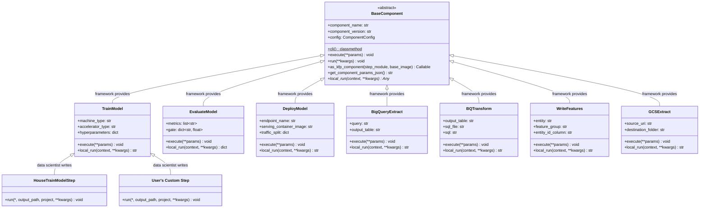
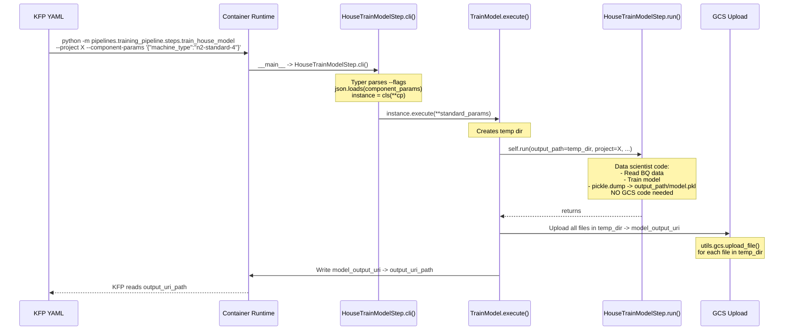
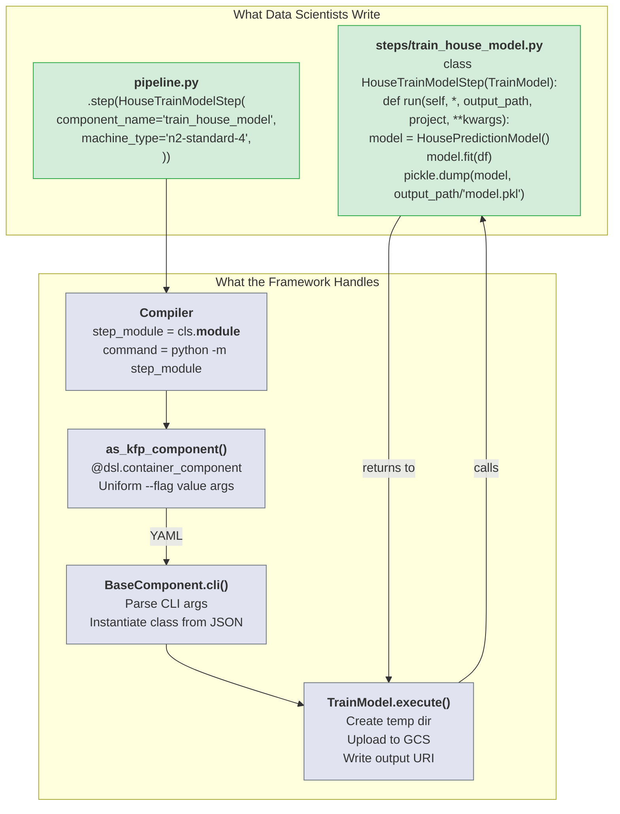

# Unified Component Lifecycle: Replacing Inlined Python Components with Container-Based Step Subclasses

## 1. Problem

The original architecture used `@dsl.component` (Python-based KFP components), which created a deeply layered parameter-passing chain with multiple serialization/deserialization hops:

**Layer 1 -- Pipeline definition:** Component dataclass fields held configuration (e.g., `hyperparameters={"C": 1.0}`).

**Layer 2 -- Compiler:** The compiler extracted every field from the dataclass and serialized complex types to JSON strings (`hyperparameters` -> `'{"C": 1.0}'`). It also computed derived params (job names, image URIs, model paths) and wired cross-step outputs. All of this was fed into the KFP component function call.

**Layer 3 -- Each component's `as_kfp_component()`:** Every component defined its own `@dsl.component`-decorated function with a bespoke parameter signature and the full execution logic inlined. This meant ~50-100 lines of boilerplate per component: `json.loads()` to deserialize parameters, GCP SDK calls, GCS upload/download, output marshalling -- all embedded inside the decorator. Because `@dsl.component` is a *Python component* (not a container component), KFP serialized the entire function body into the YAML as base64-encoded Python code.

**Layer 4 -- Compiled YAML:** The YAML contained the inlined Python code for every step, the full parameter wiring, and JSON-serialized values as string constants. The YAML was bloated and opaque.

**Layer 5 -- Container runtime:** At execution time, KFP's runtime harness deserialized the function, parsed args from the YAML, called `json.loads()` again on serialized strings, then ran the embedded logic -- which for TrainModel meant building yet another set of CLI args (`--C=1.0`, `--max_iter=1000`) to pass to a *nested* Vertex AI CustomJob, which spawned a *separate* trainer container.

**The core issues:**
- **Parameters parsed 4+ times:** Dataclass -> compiler JSON serialization -> YAML constants -> KFP runtime deserialization -> `json.loads()` inside container -> CLI args to trainer subprocess.
- **Every component duplicated boilerplate:** Each `as_kfp_component()` had its own argparse/deserialization, GCS upload logic, and output writing -- duplicated across 7 component files with slight variations.
- **Python code embedded in YAML:** `@dsl.component` inlined the function body into the YAML, making it bloated, hard to debug, and impossible to test independently.
- **Training required a nested job:** TrainModel submitted a *Vertex AI CustomJob* from inside a KFP component container -- a container launching a container -- adding latency, complexity, and making it impossible to run training directly.
- **No IDE discoverability:** Step authors had no `self.*` autocomplete. They either wrote logic inline in `as_kfp_component()` or needed to know the exact `**kwargs` keys flowing through the system.

## 2. Solution

Switched from `@dsl.component` (Python components with inlined code) to `@dsl.container_component` (container components that invoke a module directly), and redesigned `BaseComponent` to own the full execution lifecycle:

- **`@dsl.container_component` instead of `@dsl.component`:** The YAML now contains only `command: ["python", "-m", "<step_module>"]` and `args: ["--project", ..., "--component-params", "{...}"]` -- no inlined Python. The container runs the actual code from the installed package. This means the YAML is small, debuggable, and the same code runs in CI, locally, and in Vertex AI.
- **Single generic `as_kfp_component(step_module)` on `BaseComponent`:** Instead of 7 custom KFP component definitions, one base implementation generates a uniform container spec. All component-specific fields are passed as a single `--component-params` JSON blob. No per-component KFP boilerplate.
- **`cli()` classmethod:** A Typer-based CLI on `BaseComponent` that every component and step inherits. Parses standard flags (`--project`, `--region`, etc.) and `--component-params`, instantiates the class from the JSON, and calls `execute()`. Replaces all per-component argparse blocks.
- **`execute()` lifecycle method:** Each component type overrides this once to handle I/O. For example, `TrainModel.execute()` creates a temp dir, calls `self.run(output_path=temp_dir)`, uploads everything to GCS, and writes the output URI. The boilerplate lives in one place per component type, not per step.
- **`run()` for data scientists:** Step authors subclass a component (e.g., `class HouseTrainModelStep(TrainModel)`) and override `run()` with pure business logic. They get `self.*` autocomplete on all component fields, write to a local `output_path`, and never touch GCS. Training runs directly in the pipeline container -- no nested CustomJob.
- **Module path from Python itself:** The compiler reads `step.component.__class__.__module__` to get the command target. No filesystem path parsing or `step_runner` indirection.

## 3. Architecture Diagrams

### Class Hierarchy

### Runtime Execution Flow

### Data Scientist vs Framework Responsibilities

**Green** = what data scientists write. **Gray** = what the framework handles automatically.

## 4. Changes

**`gcp_ml_framework/components/base.py`** -- Core redesign. Added `cli()` classmethod (Typer CLI entrypoint that parses all standard params + `--component-params` JSON, instantiates the class, calls `execute()`). Added `execute()` (default delegates to `run()`; component subclasses override for I/O lifecycle). Added `run()` (raises `NotImplementedError`; step subclasses override with business logic). Replaced the `as_kfp_component()` signature: takes `step_module` instead of `pipeline_module`, generates `command: ["python", "-m", step_module]` with only `--flag value` args (no positional args), uses `@dsl.container_component` instead of `@dsl.component`. Removed `from __future__ import annotations` (it broke KFP's runtime inspection of `dsl.OutputPath(str)`).

**`gcp_ml_framework/components/ml/train.py`** -- Added `execute()` lifecycle: creates a temp dir, calls `self.run(output_path=temp_dir, ...)`, walks the temp dir and uploads all files to GCS via `utils.gcs.upload_file`, writes `model_output_uri` to `output_uri_path`. Added `if __name__: TrainModel.cli()` so the module is directly invocable.

**`gcp_ml_framework/components/ml/evaluate.py`** -- Added `execute()` that delegates to `utils.evaluate.run_evaluate()`, pulling metrics/gate config from `self` fields and standard params. Added `if __name__` block.

**`gcp_ml_framework/components/ml/deploy.py`** -- Added `execute()` that delegates to `utils.vertex.run_deploy()`, pulling serving config from `self` fields. Added `if __name__` block.

**`gcp_ml_framework/components/ingestion/bigquery_extract.py`** -- Added `execute()` that delegates to `utils.bigquery_extract.run_bigquery_extract()`. Added `if __name__` block.

**`gcp_ml_framework/components/ingestion/gcs_extract.py`** -- Added `execute()` that delegates to `utils.gcs_extract.run_gcs_extract()`. Added `if __name__` block.

**`gcp_ml_framework/components/transformation/bq_transform.py`** -- Added `execute()` that delegates to `utils.bq_transform.run_bq_transform()`. Added `if __name__` block.

**`gcp_ml_framework/components/feature_store/write_features.py`** -- Added `execute()` that delegates to `utils.feature_store.run_write_features()`. Added `if __name__` block.

**`gcp_ml_framework/pipeline/compiler.py`** -- Derives `step_module` from `step.component.__class__.__module__` instead of filesystem path parsing. Changed `as_kfp_component()` call to pass `step_module`. Removed `_derive_pipeline_module()` helper. Changed image name from hardcoded `"base-ml"` to per-pipeline name derived from `pipeline_def.name`.

**`pipelines/training_pipeline/steps/train_house_model.py`** -- Rewritten from a plain `run()` function (with manual GCS upload, URI parsing, storage client creation) to `class HouseTrainModelStep(TrainModel)` with `run(self, *, output_path, project, **kwargs)`. Pure business logic: reads BQ, trains model, saves `model.pkl` to `output_path`. No GCS code.

**`pipelines/training_pipeline/pipeline.py`** -- Changed import from `TrainModel` to `HouseTrainModelStep`. Uses `HouseTrainModelStep(...)` so `__class__.__module__` resolves to the step file path for the compiler.

**`scripts/docker_build.sh`** -- Removed `_build_base_ml()` and `_build_component_base()`. Added `_build_pipeline()` which builds one image per pipeline directory using the `base-ml` Dockerfile, named after the pipeline (e.g., `training-pipeline`).

**`gcp_ml_framework/step_runner.py`** -- Deleted. Replaced entirely by `BaseComponent.cli()`.
