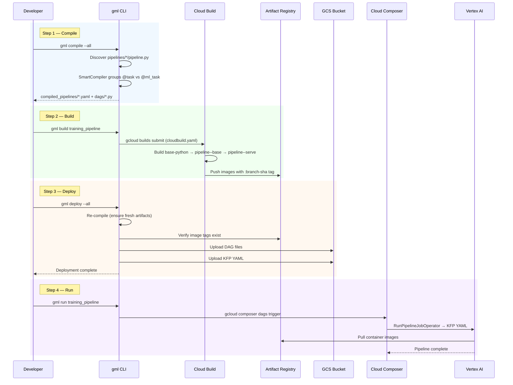
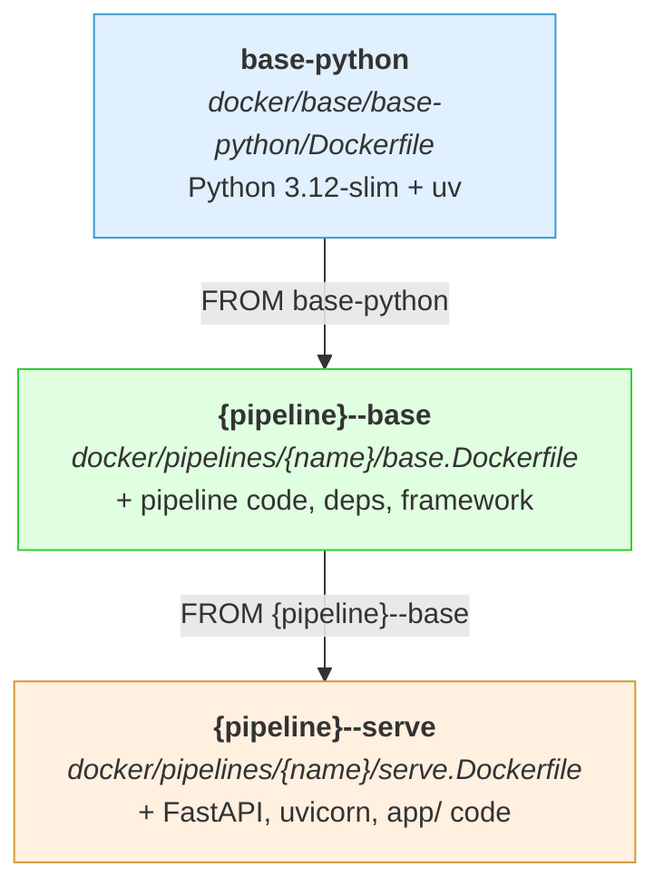

# Deployment Guide

Deploying a pipeline is a 4-step flow: **compile, build, deploy, run**. Each step builds on the previous one.

## The 4-Step Flow

```
compile          build              deploy              run
pipeline.py  --> Docker images  --> DAGs + YAML to  --> Trigger DAG
  to YAML +      to Artifact        GCS/Composer        in Composer
  DAG files      Registry
```



### Step 1: Compile

```bash
UV_ENV_FILE=.env uv run -- gml compile --all
```

**What it does:**
1. Discovers all `pipelines/*/pipeline.py` files
2. Loads each `PipelineDefinition` via `Pipeline.build()`
3. SmartCompiler analyzes task types and groups consecutive steps
4. For each `@ml_task` group: generates KFP YAML via `PipelineCompiler`
5. Generates an Airflow DAG file that orchestrates everything

**Outputs:**
- `compiled_pipelines/{pipeline_name}.yaml` -- KFP pipeline definitions
- `dags/{dag_id}.py` -- Airflow DAG files

The DAG file is self-contained Python with zero `gcp_ml_framework` imports. It contains:
- Native Airflow operators for `@task` steps (e.g., `BigQueryInsertJobOperator`)
- `RunPipelineJobOperator` for each `@ml_task` group (points to the KFP YAML on GCS)
- Sequential dependencies wiring all tasks in order

**Compile a single pipeline:**
```bash
UV_ENV_FILE=.env uv run -- gml compile training_pipeline
```

### Step 2: Build

```bash
UV_ENV_FILE=.env uv run -- gml build training_pipeline
```

**What it does:**
1. Constructs a `gcloud builds submit` command with substitution variables
2. Submits to Google Cloud Build using `cloudbuild.yaml`
3. Cloud Build executes the multi-step Docker build (see image hierarchy below)
4. Pushes all images to Artifact Registry with both `:{branch}-{sha}` and `:latest` tags

**Build all pipelines:**
```bash
UV_ENV_FILE=.env uv run -- gml build --all
```

### Step 3: Deploy

```bash
UV_ENV_FILE=.env uv run -- gml deploy --all
```

**What it does (in order):**
1. **Compiles** -- runs `gml compile` internally (always recompiles to ensure artifacts are fresh)
2. **Verifies images** -- scans compiled YAML for Artifact Registry image URIs and confirms each tag exists. If a tag is missing, it attempts to re-tag from an existing branch-matching tag. Fails if no matching image is found.
3. **Uploads DAGs** -- copies generated DAG files to the Composer GCS bucket (`GCP_COMPOSER_DAGS_PATH`)
4. **Uploads pipeline YAMLs** -- copies compiled KFP YAML to GCS at `gs://{bucket}/{branch}/pipelines/{name}/pipeline.yaml`
5. **Deploys feature schemas** -- (with `--all` only) reads `feature_schemas/` and ensures Feature Store entities exist

**Preview without deploying:**
```bash
UV_ENV_FILE=.env uv run -- gml deploy --all --dry-run
```

### Step 4: Run

**Trigger via Composer (production):**
```bash
UV_ENV_FILE=.env uv run -- gml run training_pipeline
```

This runs `gcloud composer environments run ... dags trigger -- {dag_id}` to trigger the deployed DAG.

**Run locally (development):**
```bash
UV_ENV_FILE=.env uv run -- gml run training_pipeline --local
```

Executes all steps sequentially in your local Python process against real GCP dev resources. Useful for testing end-to-end before deploying.

## Docker Image Hierarchy

Cloud Build produces three tiers of images per pipeline:

```
Tier 0: base-python (shared)
  |
  +-- Python 3.12-slim + uv
  |   Dockerfile: docker/base/base-python/Dockerfile
  |
  v
Tier 1: {pipeline}--base (per-pipeline execution image)
  |
  +-- Adds pipeline code, dependencies, framework
  |   Dockerfile: docker/pipelines/{name}/base.Dockerfile
  |   ARG BASE_IMAGE=base-python
  |
  v
Tier 1: {pipeline}--serve (per-pipeline serving image)
      +-- Extends pipeline base, adds FastAPI + uvicorn + app code
          Dockerfile: docker/pipelines/{name}/serve.Dockerfile
          ARG BASE_IMAGE={pipeline}--base
```



Concrete example for `house_price`:

| Image | AR Name | Dockerfile |
|-------|---------|------------|
| Foundation | `base-python` | `docker/base/base-python/Dockerfile` |
| Execution | `house-price--base` | `docker/pipelines/house_price/base.Dockerfile` |
| Serving | `house-price--serve` | `docker/pipelines/house_price/serve.Dockerfile` |

Image naming uses double-hyphen (`--`) as the delimiter between pipeline and role. This is controlled by `NamingConvention.docker_image_name()`.

Tags are always `{branch}-{short_sha}` for traceability. The `:latest` tag is also pushed for cache-from optimization but should never be referenced in production configs.

## Cloud Build Configuration

`cloudbuild.yaml` defines 9 steps that execute sequentially:

| Step | Action |
|------|--------|
| 0 | Pull cached `base-python:latest` (ignore if first build) |
| 1 | Build `base-python` with `--cache-from` |
| 2 | Push `base-python` (both `:latest` and `:{tag}`) |
| 3 | Pull cached `{pipeline}--base:latest` |
| 4 | Build `{pipeline}--base` from `base-python:{tag}` |
| 5 | Push `{pipeline}--base` |
| 6 | Pull cached `{pipeline}--serve:latest` |
| 7 | Build `{pipeline}--serve` from `{pipeline}--base:{tag}` |
| 8 | Push `{pipeline}--serve` |

Substitution variables passed by `gml build`:
- `_TAG` -- image tag (`{branch}-{sha}`)
- `_PIPELINE` -- slugified pipeline name (e.g., `house-price`)
- `_PIPELINE_DIR` -- pipeline directory name (e.g., `house_price`)
- `_AR_REPO` -- Artifact Registry repository path

Build machine: `E2_HIGHCPU_8` with `CLOUD_LOGGING_ONLY`.

The `--cache-from` strategy pulls `:latest` before each build step. On subsequent builds, Docker reuses cached layers, significantly reducing build time when only application code changes.

## Composer DAG Sync

After `gml deploy` uploads DAGs to the Composer bucket, there is a delay before Composer picks them up.

**Wait approximately 5 minutes** after deploying before triggering the DAG. Composer's scheduler scans for new/updated DAG files periodically. If you trigger immediately, you may hit a stale or missing DAG.

Verify the DAG is visible:

```bash
gcloud composer environments run <env-name> \
  --location <region> \
  --project <project> \
  dags list
```

## Troubleshooting

### `Image not found` during deploy

```
Error: Image not found: us-docker.pkg.dev/.../house-price--base:main-abc1234
Run `gml build` to build and push images.
```

The compiled YAML references an image tag that does not exist in Artifact Registry. Run `gml build` first:

```bash
UV_ENV_FILE=.env uv run -- gml build house_price
UV_ENV_FILE=.env uv run -- gml deploy house_price
```

### Cloud Build fails

Check the Cloud Build logs:
```
https://console.cloud.google.com/cloud-build/builds?project=<your-project>
```

Common causes:
- **Permission denied on Artifact Registry** -- The build service account needs `roles/artifactregistry.writer`. See `docs/cloud_build_iam.md`.
- **Dockerfile not found** -- Verify the `base.Dockerfile` and `serve.Dockerfile` exist at `docker/pipelines/{name}/`.
- **Build timeout** -- Default is 1200 seconds. Increase with `--timeout`: `gml build house_price --timeout 2400`.

### DAG not appearing in Composer

1. Verify the DAG file was uploaded: `gsutil ls gs://composer-bucket/dags/`
2. Wait 5 minutes for Composer to pick it up
3. Check for syntax errors in the DAG: download it and run `python dags/{dag_id}.py` locally
4. Check Composer logs in Cloud Logging for import errors

### Pipeline fails in Vertex AI

1. Check the Vertex AI Pipeline run in the console: `https://console.cloud.google.com/vertex-ai/pipelines`
2. Click the failed step to see container logs
3. Common issues:
   - **Module not found** -- The step module path does not match the package structure in the Docker image. Verify `COPY` directives in `base.Dockerfile`.
   - **GCS permission denied** -- The pipeline service account (`GCP_PIPELINE_SERVICE_ACCOUNT_EMAIL`) needs `roles/storage.objectAdmin` on the pipeline bucket.
   - **Quota exceeded** -- Check Vertex AI quotas for your region.

### `gml compile` fails with import error

The pipeline definition imports step classes which may have dependencies not installed locally. Run:

```bash
uv sync --all-extras
```

### Schedule not appearing in Composer

In `dev` environment, the SmartCompiler sets `schedule=None` (paused) to prevent unintended runs. This is by design. Trigger manually with `gml run`.

### Model deployment fails with CRUD quota error

The framework uses `sync=False` on `Model.upload()` to avoid CRUD quota exhaustion on shared GCP projects. If you still hit quota limits, space out your deployments or request a quota increase.
