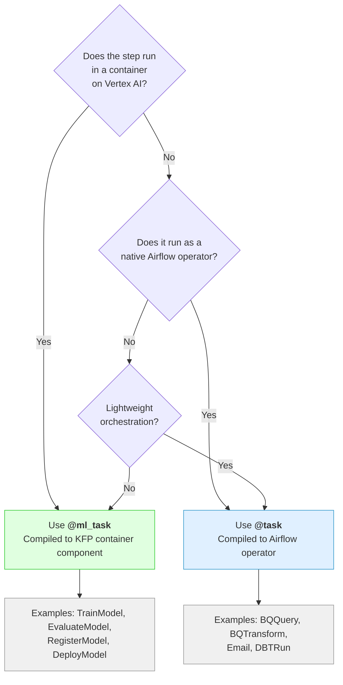
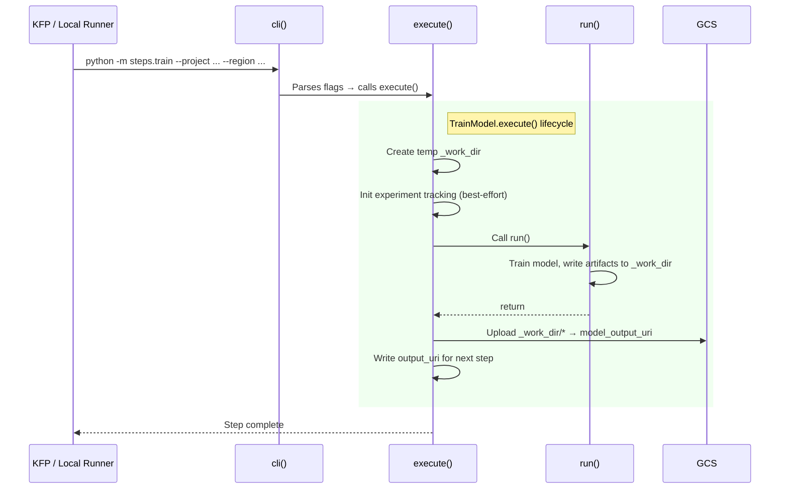

# Writing Components

Components are the building blocks of pipelines. Every step in a pipeline is a component. This guide covers how to write them.

## Two Types of Components

The framework has two task types, set by decorators:

| Decorator | Compiled to | Runs where | Use for |
|-----------|-------------|------------|---------|
| `@task` | Native Airflow operator | Composer worker | BQ queries, email, dbt, lightweight orchestration |
| `@ml_task` | KFP container component | Vertex AI container | Training, evaluation, registration, deployment |

The decorator determines how the SmartCompiler handles the component. You do not choose at compile time -- it is fixed on the class.



## Component Lifecycle

Every component follows the same lifecycle:

```
cli()  -->  execute()  -->  run()
```

- `cli()` -- Auto-generated Typer CLI. Every Pydantic field (except internal ones) becomes a `--flag`. You never override this.
- `execute()` -- Container lifecycle. Handles I/O: temp directories, GCS upload/download, output URI writing. Component base classes (like `TrainModel`) override this.
- `run()` -- **Business logic. This is the only method data scientists override.**

## Writing a Training Step

### 1. Subclass `TrainModel`

`TrainModel` is an `@ml_task` component that provides:
- A managed temp directory at `self._work_dir`
- Automatic GCS upload of everything in `_work_dir` after `run()` completes
- Output URI writing for cross-step data flow
- Experiment tracking (best-effort, non-fatal)



### 2. Override `run()` and write artifacts to `self._work_dir`

Here is the reference training step from `pipelines/house_price/steps/train_regression_model.py`:

```python
import pickle

from loguru import logger
from gcp_ml_framework.components.ml.train import TrainModel


class HouseTrainModelStep(TrainModel):
    """Train a house price prediction model."""

    def run(self) -> None:
        from google.cloud import bigquery
        from second_run.estimator import HousePredictionModel

        # Read training data from BigQuery
        client = bigquery.Client(project=self.project)
        query = "SELECT * FROM ..."
        df = client.query(query).to_dataframe()

        # Train model
        model = HousePredictionModel()
        model.fit(df, df["price"])

        # Save model to self._work_dir -- execute() uploads to GCS
        local_path = self._work_dir / "model.pkl"
        with open(local_path, "wb") as f:
            pickle.dump(model, f)
        logger.info(f"Model saved to {local_path}")
```

What you get for free from `TrainModel.execute()`:
- `self._work_dir` is a fresh temp directory created before `run()` is called
- After `run()` returns, every file in `_work_dir` is uploaded to GCS at `self.model_output_uri`
- The output URI is written to `self.output_uri_path` for the next step to consume

### 3. Add the `if __name__` block

Every step file must be executable as a CLI:

```python
if __name__ == "__main__":
    HouseTrainModelStep.cli()
```

This is how KFP runs the component inside the container: `python -m pipelines.house_price.steps.train_regression_model --project ... --region ...`

### 4. Available fields in `run()`

All fields from `BaseComponent` are available as `self.<field>`:

| Field | Type | Description |
|-------|------|-------------|
| `self.project` | `str` | GCP project ID |
| `self.region` | `str` | GCP region |
| `self.project_name` | `str` | Project slug |
| `self.branch` | `str` | Git branch (slugified) |
| `self.environment` | `str` | Environment name |
| `self.run_date` | `str` | Execution date (YYYY-MM-DD) |
| `self.dataset` | `str` | BQ dataset name |
| `self.machine_type` | `str` | VM machine type |

`TrainModel` adds:

| Field | Type | Description |
|-------|------|-------------|
| `self.model_output_uri` | `str` | GCS URI for model artifacts |
| `self.job_name` | `str` | Training job identifier |
| `self.run_id` | `str` | Unique run identifier |
| `self.experiment_name` | `str` | Vertex AI experiment name |
| `self._work_dir` | `Path` | Managed temp directory (write artifacts here) |

## Writing an Evaluation Step

### Subclass `EvaluateModel`

`EvaluateModel` is an `@ml_task` component for running metrics and applying quality gates.

```python
from gcp_ml_framework.components.ml.evaluate import EvaluateModel


class HouseEvaluateStep(EvaluateModel):
    """Housing regression evaluation."""

    component_name: str = "evaluate_house_model"

    def run(self) -> None:
        # Optionally set dataset_uri if not bridged from a @task step
        if not self.dataset_uri:
            self.dataset_uri = f"{self.project}.{self.dataset}.training_features"
        super().run()
```

`EvaluateModel` fields:

| Field | Type | Description |
|-------|------|-------------|
| `self.metrics` | `list[str]` | Metric names to compute (e.g. `["rmse", "mae", "r2"]`) |
| `self.gate` | `dict[str, float]` | Thresholds that must be met (e.g. `{"rmse": 1_000_000}`) |
| `self.dataset_uri` | `str` | BQ table or GCS URI for evaluation data |
| `self.model_uri` | `str` | GCS URI to the trained model |

If a gate threshold is not met, the component raises an exception, halting the pipeline.

## Writing an Airflow Operator (`@task`)

`@task` components render to native Airflow operators. They must implement `render_operator()` which returns Python source code for the DAG file.

### Built-in `@task` components

| Component | Renders to |
|-----------|-----------|
| `BQQuery` | `BigQueryInsertJobOperator` |
| `BQTransform` | `BigQueryInsertJobOperator` |
| `Email` | `EmailOperator` |
| `DBTRun` | `BashOperator` (dbt CLI) |

### Using `BQQuery` in a pipeline

```python
from gcp_ml_framework.components.operators.bq_query import BQQuery

BQQuery(
    sql="SELECT * FROM `{bq_dataset}.housing_data_table`",
    destination_table="training_raw",
    component_name="ingest_raw_data",
)
```

Template variables in SQL are resolved at compile time:
- `{bq_dataset}` -- branch-namespaced BQ dataset
- `{gcs_prefix}` -- branch GCS path
- `{namespace}` -- branch namespace
- `{run_date}` -- converted to the Airflow `{{ ds }}` macro

### Writing a custom `@task` component

If you need a new Airflow operator type, create a class decorated with `@task` and implement `render_operator()`:

```python
from gcp_ml_framework.components.base import BaseComponent
from gcp_ml_framework.decorators import task

@task
class MyOperator(BaseComponent):
    some_param: str = ""
    component_name: str = "my_operator"

    def execute(self) -> None:
        """Local execution logic (for gml run --local)."""
        ...

    def render_operator(self, context, pipeline_dir=None):
        """Return (operator_code, imports) for DAG generation."""
        imports = {"from airflow.operators.bash import BashOperator"}
        code = f'''BashOperator(
        task_id="{{{{ task_id }}}}",
        bash_command="echo {self.some_param}",
    )'''
        return code, imports
```

The `{{ task_id }}` placeholder is replaced by the SmartCompiler with the step's sanitized name.

**Generated DAGs must have zero `gcp_ml_framework` imports.** The `render_operator()` method must produce self-contained Python code using only Airflow imports.

## Testing Your Component

### Unit test pattern

Write a unit test that verifies `run()` produces the expected artifacts:

```python
import pytest
from unittest.mock import patch, MagicMock

@pytest.mark.unit
def test_train_step_writes_model(tmp_path):
    from pipelines.house_price.steps.train_regression_model import HouseTrainModelStep

    step = HouseTrainModelStep(
        project="test-project",
        region="us-central1",
    )
    step._work_dir = tmp_path

    with patch("google.cloud.bigquery.Client") as mock_bq:
        mock_bq.return_value.query.return_value.to_dataframe.return_value = mock_df
        step.run()

    assert (tmp_path / "model.pkl").exists()
```

### Testing `@task` components

Test that `render_operator()` produces valid code and expected imports:

```python
@pytest.mark.unit
def test_bq_query_render_operator(mock_context):
    from gcp_ml_framework.components.operators.bq_query import BQQuery

    comp = BQQuery(
        sql="SELECT 1",
        component_name="test",
    )
    code, imports = comp.render_operator(mock_context)

    assert "BigQueryInsertJobOperator" in code
    assert any("BigQueryInsertJobOperator" in imp for imp in imports)
```

## Common Patterns and Pitfalls

### Do: Write artifacts to `self._work_dir`

```python
# Correct
local_path = self._work_dir / "model.pkl"
```

### Do not: Upload to GCS manually in `run()`

`TrainModel.execute()` handles GCS upload. If you upload in `run()`, you will duplicate the upload.

### Do: Use loguru, not print or stdlib logging

```python
from loguru import logger
logger.info("Training started")
```

### Do: Add `if __name__ == "__main__"` to every step file

```python
if __name__ == "__main__":
    MyStep.cli()
```

Without this, KFP cannot execute the step in a container.

### Do: Set `runtime_dockerfile` on every component in the pipeline

```python
HouseTrainModelStep(
    component_name="train",
    runtime_dockerfile="pipelines/house_price/base.Dockerfile",  # Required
)
```

### Do not: Set `serving_dockerfile` on anything other than `RegisterModel`

`RegisterModel` is the single owner of the serving container image. This is a non-negotiable design decision.

### Do: Use the same `model_name` on `RegisterModel` and `DeployModel`

```python
RegisterModel(model_name="regression", ...)
DeployModel(model_name="regression", ...)
```

The compiler derives matching `model_display_name` and `endpoint_display_name` from this value.

### Do not: Construct GCP resource names manually

All resource names flow through `NamingConvention`. If you need a resource name, use the naming module or context object.

### Do: Add custom fields to your step subclass

```python
class MyTrainStep(TrainModel):
    learning_rate: float = 0.01
    epochs: int = 100

    def run(self) -> None:
        # self.learning_rate and self.epochs are available
        ...
```

Custom fields automatically become CLI flags and KFP input parameters.
