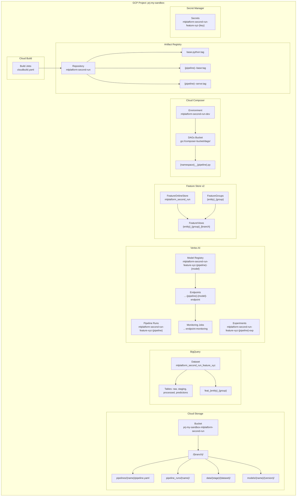
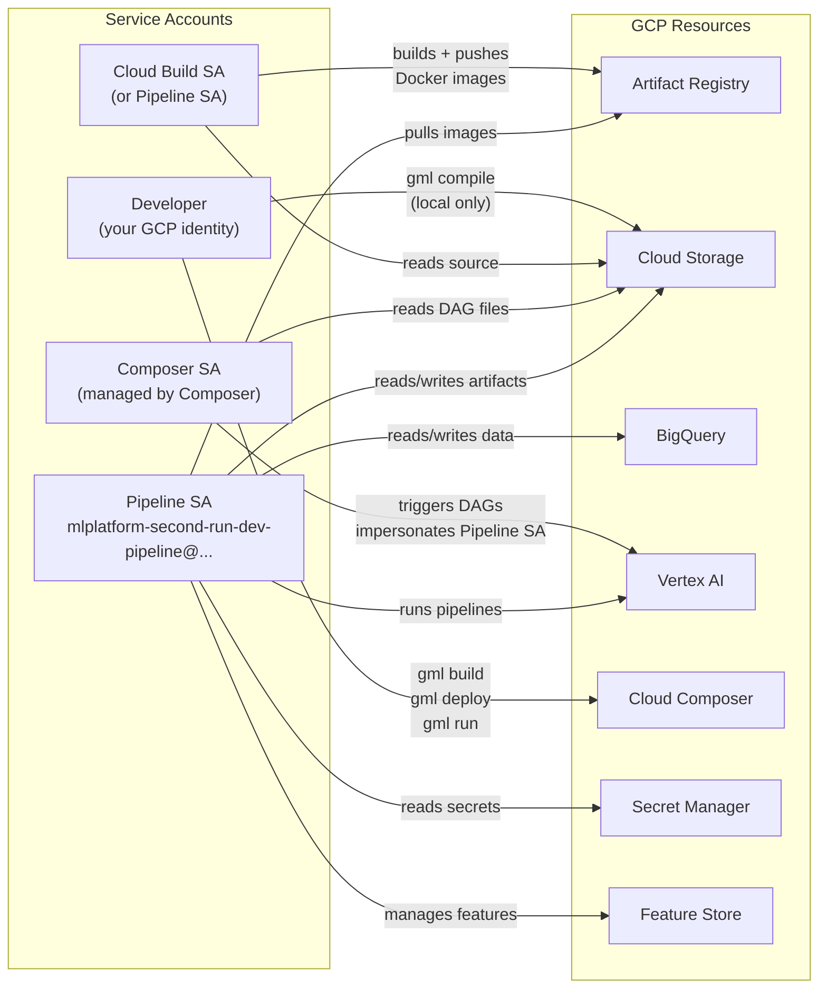
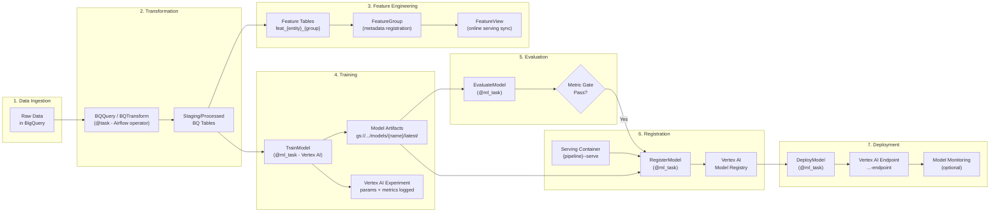
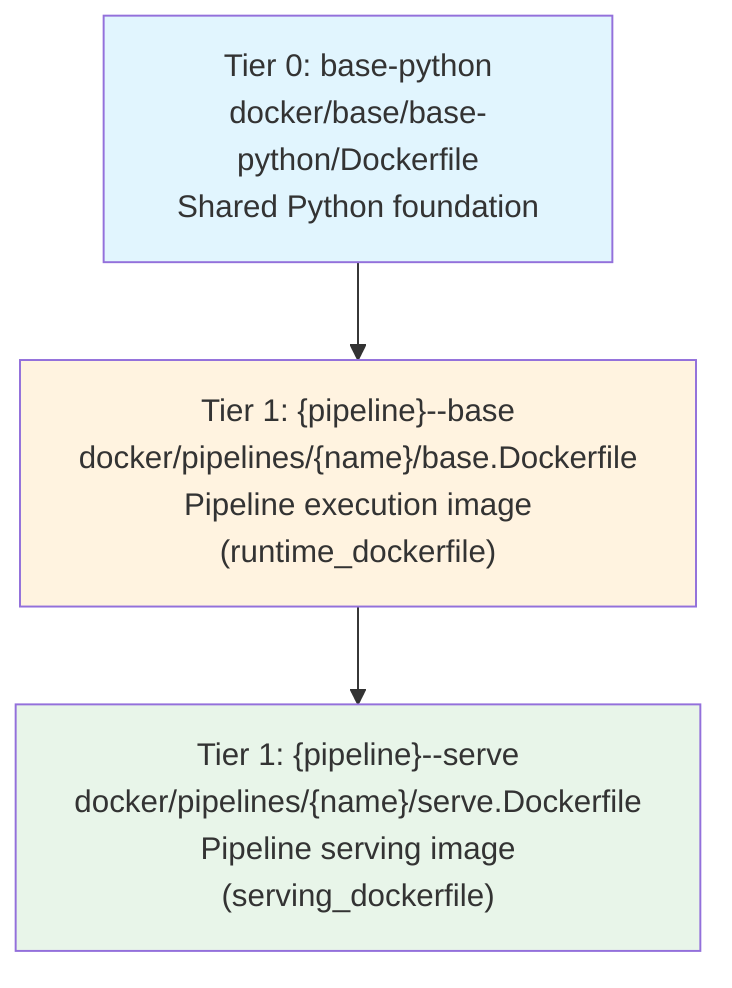
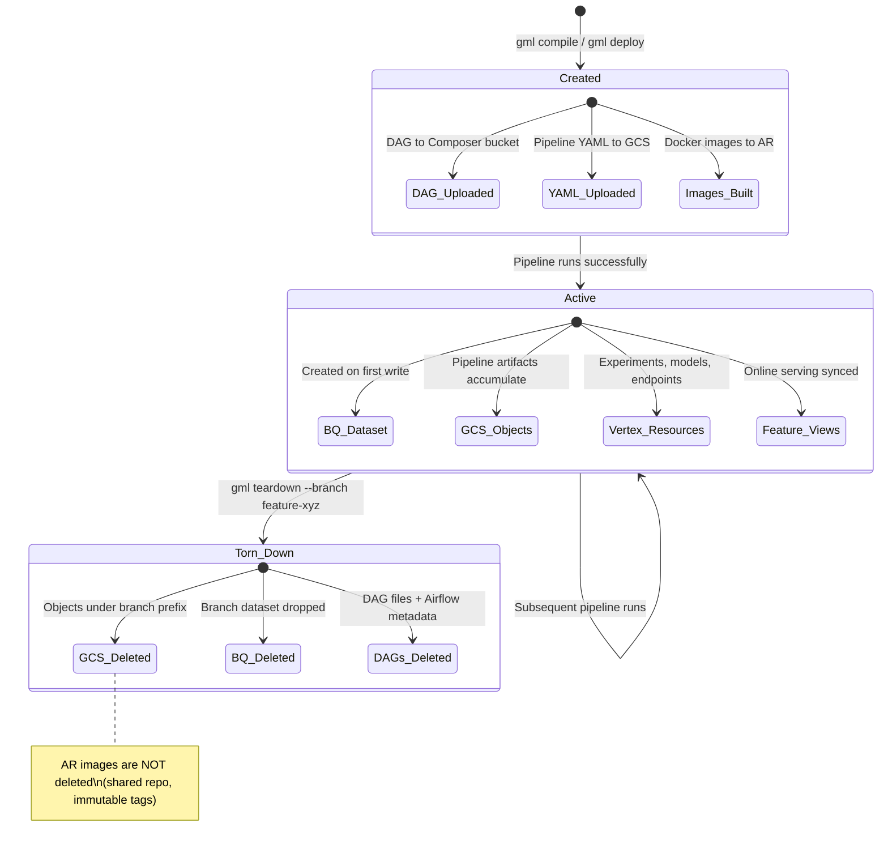

# GCP Resource Map

How the GCP ML Framework creates, names, and manages GCP resources.

Every resource name flows from `NamingConvention` in `gcp_ml_framework/naming.py`. The namespace token is:

```
{team}-{project}-{branch}
```

For examples throughout this doc, we use:

| Variable       | Value            |
|----------------|------------------|
| `TEAM`         | `mlplatform`     |
| `PROJECT`      | `second_run`     |
| `BRANCH`       | `feature-xyz`    |
| `GCP_PROJECT_ID` | `prj-my-sandbox` |
| `GCP_REGION`   | `us-east4`       |

Namespace: **`mlplatform-second-run-feature-xyz`**

---

## 1. Resource Map



---

## 2. Naming Convention Table

All names are derived by `NamingConvention` (`gcp_ml_framework/naming.py`). The `_slugify()` function lowercases, replaces non-alphanumeric runs with hyphens, and truncates. `_bq_safe()` uses underscores instead (BigQuery requirement).

| Resource | Method | Derived Name |
|----------|--------|-------------|
| **Namespace** | `namespace` | `mlplatform-second-run-feature-xyz` |
| **BQ Namespace** | `namespace_bq` | `mlplatform_second_run_feature_xyz` |
| **GCS Bucket** | `gcs_bucket` | `prj-my-sandbox-mlplatform-second-run` |
| **GCS Prefix** | `gcs_prefix` | `gs://prj-my-sandbox-mlplatform-second-run/feature-xyz/` |
| **GCS Pipeline Root** | `gcs_pipeline_root("training")` | `.../feature-xyz/pipelines/training` |
| **GCS Data Path** | `gcs_data_path("raw", "sales")` | `.../feature-xyz/data/raw/sales` |
| **GCS Model Path** | `gcs_model_path("regression")` | `.../feature-xyz/models/regression/latest` |
| **BQ Dataset** | `bq_dataset` | `mlplatform_second_run_feature_xyz` |
| **BQ Table** | `bq_table("predictions")` | `mlplatform_second_run_feature_xyz.predictions` |
| **BQ Feature Table** | `bq_feature_table("user", "behavioral")` | `mlplatform_second_run_feature_xyz.feat_user_behavioral` |
| **Vertex Pipeline** | `vertex_pipeline_display_name("training")` | `mlplatform-second-run-feature-xyz-training` |
| **Vertex Experiment** | `vertex_experiment("training")` | `mlplatform-second-run-feature-xyz-training-exp` |
| **Vertex Model** | `vertex_model_name("training", "regression")` | `mlplatform-second-run-feature-xyz-training-regression` |
| **Vertex Endpoint** | `vertex_endpoint_name("training", "regression")` | `mlplatform-second-run-feature-xyz-training-regression-endpoint` |
| **Vertex Training Job** | `vertex_training_job_name("train_hp")` | `mlplatform-second-run-feature-xyz-train-hp` |
| **AR Repo** | `artifact_registry_repo(host, proj)` | `us-east4-docker.pkg.dev/prj-my-sandbox/mlplatform-second-run` |
| **Docker Image Name** | `docker_image_name("house_price", "base")` | `house-price--base` |
| **Image Tag** | `image_tag("img")` | `feature-xyz-a1b2c3d` |
| **Image URI** | `docker_image_uri(...)` | `us-east4-docker.pkg.dev/prj-my-sandbox/mlplatform-second-run/house-price--base:feature-xyz-a1b2c3d` |
| **Feature Store ID** | `feature_store_id` | `mlplatform_second_run` |
| **Feature View** | `feature_view_id("user", "behavioral")` | `user_behavioral_feature_xyz` |
| **DAG ID** | `dag_id("training")` | `mlplatform_second_run_feature_xyz__training` |
| **Secret Name** | `secret_name("db-password")` | `mlplatform-second-run-feature-xyz-db-password` |
| **Composer Env** | derived in `MLContext` | `mlplatform-second-run-dev` |
| **Pipeline SA** | derived in `MLContext` | `mlplatform-second-run-dev-pipeline@prj-my-sandbox.iam.gserviceaccount.com` |

---

## 3. Branch Isolation

Different branches get their own isolated namespaces for data and compute resources, while sharing the Artifact Registry repository and GCS bucket.

```mermaid
graph TB
    subgraph "SHARED across all branches"
        GCS_BUCKET["GCS Bucket<br/>prj-my-sandbox-mlplatform-second-run"]
        AR_REPO["AR Repository<br/>us-east4-docker.pkg.dev/prj-my-sandbox/mlplatform-second-run"]
        FS_STORE["FeatureOnlineStore<br/>mlplatform_second_run"]
    end

    subgraph "Branch: main"
        GCS_MAIN["GCS: .../main/pipelines/<br/>.../main/models/<br/>.../main/data/"]
        BQ_MAIN["BQ Dataset:<br/>mlplatform_second_run_main"]
        DAG_MAIN["DAG: mlplatform_second_run_main__training"]
        VTX_MAIN["Vertex Experiment:<br/>...-main-training-exp"]
        MODEL_MAIN["Vertex Model:<br/>...-main-training-regression"]
        EP_MAIN["Vertex Endpoint:<br/>...-main-training-regression-endpoint"]
        FV_MAIN["FeatureView:<br/>user_behavioral_main"]
        SECRET_MAIN["Secret:<br/>...-main-db-password"]
    end

    subgraph "Branch: feature-xyz"
        GCS_FEAT["GCS: .../feature-xyz/pipelines/<br/>.../feature-xyz/models/<br/>.../feature-xyz/data/"]
        BQ_FEAT["BQ Dataset:<br/>mlplatform_second_run_feature_xyz"]
        DAG_FEAT["DAG: mlplatform_second_run_feature_xyz__training"]
        VTX_FEAT["Vertex Experiment:<br/>...-feature-xyz-training-exp"]
        MODEL_FEAT["Vertex Model:<br/>...-feature-xyz-training-regression"]
        EP_FEAT["Vertex Endpoint:<br/>...-feature-xyz-training-regression-endpoint"]
        FV_FEAT["FeatureView:<br/>user_behavioral_feature_xyz"]
        SECRET_FEAT["Secret:<br/>...-feature-xyz-db-password"]
    end

    GCS_BUCKET --> GCS_MAIN
    GCS_BUCKET --> GCS_FEAT
    AR_REPO --> |"images tagged<br/>main-a1b2c3d"| BQ_MAIN
    AR_REPO --> |"images tagged<br/>feature-xyz-d4e5f6g"| BQ_FEAT
    FS_STORE --> FV_MAIN
    FS_STORE --> FV_FEAT
```



### What is shared vs. isolated

| Resource | Shared or Isolated | Isolation Key |
|----------|-------------------|---------------|
| GCS Bucket | **Shared** | Branch is a path prefix (`/{branch}/`) |
| AR Repository | **Shared** | Branch is in the image tag (`{branch}-{sha}`) |
| Feature Online Store | **Shared** | Branch is in the FeatureView ID |
| BQ Dataset | **Isolated** | Full dataset name includes branch |
| Vertex AI Experiments | **Isolated** | Display name includes branch |
| Vertex AI Models | **Isolated** | Display name includes branch |
| Vertex AI Endpoints | **Isolated** | Display name includes branch |
| Composer DAGs | **Isolated** | DAG ID includes branch |
| Secret Manager | **Isolated** | Secret name includes branch |
| Feature Views | **Isolated** | View ID includes branch |

---

## 4. IAM Relationships



### Required IAM Roles

| Service Account | Required Roles | Purpose |
|----------------|---------------|---------|
| **Pipeline SA** | `roles/aiplatform.user` | Run Vertex AI pipelines, manage models and endpoints |
| | `roles/bigquery.dataEditor` | Read/write BQ datasets and tables |
| | `roles/storage.objectAdmin` | Read/write GCS objects (models, data, pipeline YAML) |
| | `roles/artifactregistry.reader` | Pull container images during pipeline execution |
| | `roles/secretmanager.secretAccessor` | Read secrets at runtime |
| | `roles/aiplatform.featurestoreUser` | Read/write Feature Store v2 resources |
| **Composer SA** | `roles/composer.worker` | Run Airflow workers |
| | `roles/iam.serviceAccountUser` on Pipeline SA | Impersonate Pipeline SA when launching Vertex AI jobs |
| **Cloud Build SA** | `roles/artifactregistry.writer` | Push Docker images |
| | `roles/storage.objectViewer` | Read build context |
| | `roles/logging.logWriter` | Write build logs |
| **Developer** | `roles/composer.user` | Trigger DAGs via `gml run` |
| | `roles/cloudbuild.builds.editor` | Submit builds via `gml build` |
| | `roles/storage.objectAdmin` | Upload DAGs and pipeline YAML via `gml deploy` |

### Composer-to-Pipeline SA Impersonation

The generated Airflow DAG uses `RunPipelineJobOperator` with `service_account` set to the Pipeline SA email. Cloud Composer's own service account must have `roles/iam.serviceAccountUser` on the Pipeline SA to launch Vertex AI pipeline runs under that identity.

```
Composer SA  --[iam.serviceAccountUser]-->  Pipeline SA  --[aiplatform.user]--> Vertex AI
```

---

## 5. Data Flow Through GCP

End-to-end flow from raw data to a deployed model endpoint.



### Detailed Data Locations at Each Stage

| Stage | Location | Example Path |
|-------|----------|-------------|
| Raw data | BigQuery (external) | `prj-my-sandbox.raw_data.house_sales` |
| Transformed data | BQ dataset (branch-scoped) | `prj-my-sandbox.mlplatform_second_run_feature_xyz.processed_sales` |
| Feature tables | BQ dataset (branch-scoped) | `prj-my-sandbox.mlplatform_second_run_feature_xyz.feat_house_behavioral` |
| Model artifacts | GCS (branch-scoped) | `gs://prj-my-sandbox-mlplatform-second-run/feature-xyz/models/regression/latest/model.pkl` |
| Compiled pipeline | GCS (branch-scoped) | `gs://prj-my-sandbox-mlplatform-second-run/feature-xyz/pipelines/training/pipeline.yaml` |
| Pipeline run artifacts | GCS (branch-scoped) | `gs://prj-my-sandbox-mlplatform-second-run/feature-xyz/pipeline_runs/training/` |
| Registered model | Vertex AI Model Registry | `mlplatform-second-run-feature-xyz-training-regression` (display name) |
| Deployed model | Vertex AI Endpoint | `mlplatform-second-run-feature-xyz-training-regression-endpoint` |
| DAG file | Composer GCS bucket | `gs://composer-bucket/dags/mlplatform_second_run_feature_xyz__training.py` |

---

## 6. Docker Image Hierarchy

Cloud Build (`cloudbuild.yaml`) builds images in a three-tier hierarchy with layer caching.



### Image Naming Convention

`NamingConvention.docker_image_name()` uses the `--` delimiter to scope images to pipelines:

| Dockerfile Location | `docker_image_name()` | Full AR URI |
|---------------------|-----------------------|-------------|
| `docker/base/base-python/Dockerfile` | `base-python` | `.../mlplatform-second-run/base-python:feature-xyz-a1b2c3d` |
| `docker/pipelines/house_price/base.Dockerfile` | `house-price--base` | `.../mlplatform-second-run/house-price--base:feature-xyz-a1b2c3d` |
| `docker/pipelines/house_price/serve.Dockerfile` | `house-price--serve` | `.../mlplatform-second-run/house-price--serve:feature-xyz-a1b2c3d` |

### Image Tag Format

Tags encode traceability: `{branch_slug}-{short_sha}`

- `feature-xyz-a1b2c3d` -- you can trace any running container back to the exact commit and branch.
- Cloud Build also pushes `:latest` for layer cache warm-starts on subsequent builds.

---

## 7. GCS Bucket Layout

The GCS bucket is shared across branches. Each branch gets its own prefix.

```
gs://prj-my-sandbox-mlplatform-second-run/
  feature-xyz/
    pipelines/
      training/
        pipeline.yaml          # Compiled KFP YAML
      house_price/
        pipeline.yaml
    pipeline_runs/
      training/                # Vertex AI pipeline run artifacts
    data/
      raw/
        sales/
      staging/
        processed_sales/
      processed/
      features/
    models/
      regression/
        latest/
          model.pkl
          metadata.json
  main/
    pipelines/...
    models/...
    data/...
```

---

## 8. Secret Manager Naming

Secrets are branch-namespaced so DEV, STAGING, and PROD can have independent values for the same logical key.

```
Short key:    db-password
Namespace:    mlplatform-second-run-feature-xyz
Secret name:  mlplatform-second-run-feature-xyz-db-password
Resource:     projects/prj-my-sandbox/secrets/mlplatform-second-run-feature-xyz-db-password/versions/latest
```

In local development, `LocalSecretClient` reads from environment variables instead:

```
GML_SECRET_DB_PASSWORD=my-local-value
```

---

## 9. Resource Lifecycle Summary



`gml teardown` only runs for DEV branches -- it will refuse to touch STAGING or PROD. It deletes:

1. GCS objects under `gs://{bucket}/{branch}/`
2. BigQuery dataset `{namespace_bq}`
3. Composer DAG files matching `{namespace_bq}__*`
4. Airflow metadata for those DAGs

It does **not** delete: AR images, Vertex AI models/endpoints (manual cleanup), or Feature Store online stores.
