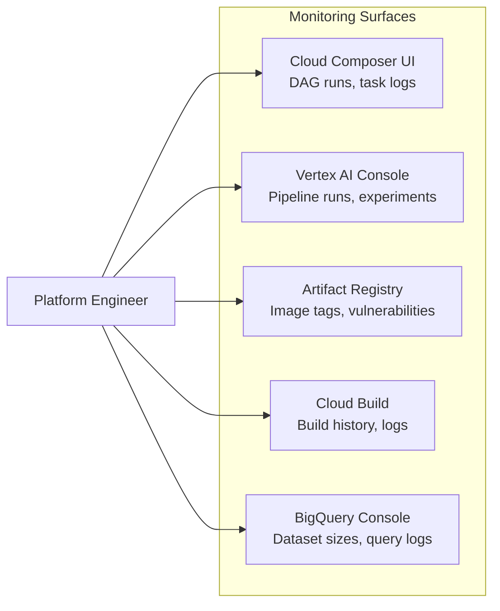
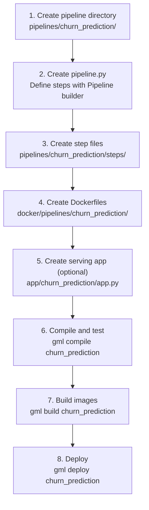
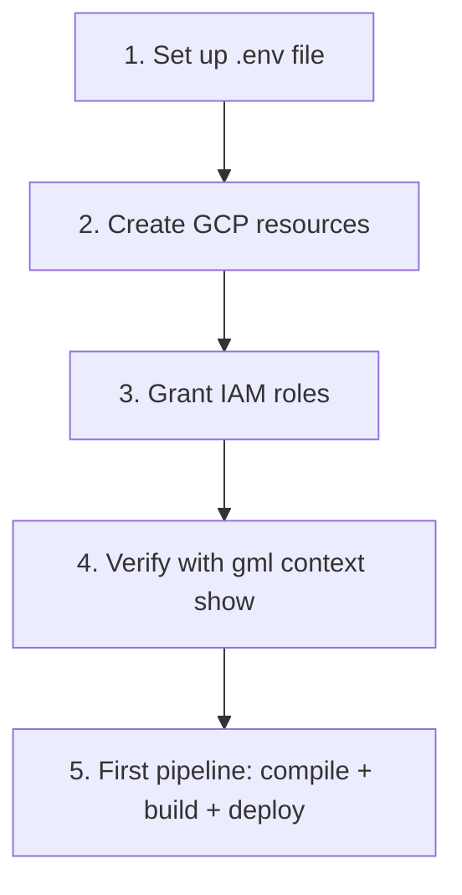
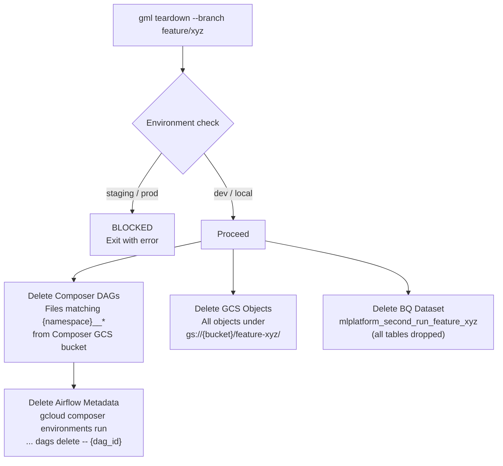
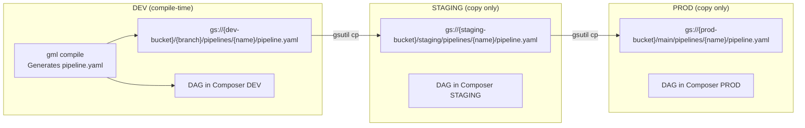
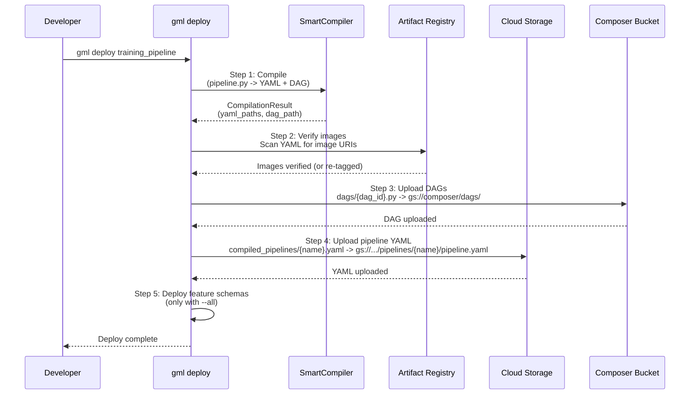

# Platform Maintainer Guide

Operational guide for platform engineers maintaining the GCP ML Framework. This covers day-to-day operations, adding new pipelines, onboarding teams, troubleshooting, branch lifecycle, teardown, and environment promotion.

---

## 1. Day-to-Day Operations

### Monitoring Deployed Pipelines



**Key things to check daily:**

| What | Where | How |
|------|-------|-----|
| DAG run status | Composer UI | Look for failed tasks in the DAG view |
| Vertex AI pipeline status | Vertex AI > Pipelines | Filter by display name prefix (`{namespace}-`) |
| Experiment metrics | Vertex AI > Experiments | Compare runs within `{namespace}-{pipeline}-exp` |
| Model versions | Vertex AI > Model Registry | Check latest version for `{namespace}-{pipeline}-{model}` |
| Endpoint health | Vertex AI > Endpoints | Monitor traffic, latency, error rate |
| Build failures | Cloud Build > History | Filter by trigger or substitution `_PIPELINE` |
| Image tags | Artifact Registry | Verify expected `{branch}-{sha}` tags exist |

### Useful CLI Commands

```bash
# Show the current context (namespace, GCP project, all derived names)
UV_ENV_FILE=.env uv run -- gml context show

# Compile all pipelines (validates pipeline.py files, generates YAML + DAGs)
UV_ENV_FILE=.env uv run -- gml compile --all

# Deploy all pipelines (compile + verify images + upload DAGs + upload YAML)
UV_ENV_FILE=.env uv run -- gml deploy --all

# Dry-run deploy to see what would happen
UV_ENV_FILE=.env uv run -- gml deploy --all --dry-run

# Build Docker images for a specific pipeline
UV_ENV_FILE=.env uv run -- gml build training_pipeline

# Trigger a deployed pipeline via Composer
UV_ENV_FILE=.env uv run -- gml run training_pipeline

# Run locally against real GCP dev resources
UV_ENV_FILE=.env uv run -- gml run training_pipeline --local
```

---

## 2. Adding a New Pipeline

Step-by-step guide for adding a pipeline named `churn_prediction`.



### Step 1: Create the pipeline directory

```bash
mkdir -p pipelines/churn_prediction/steps
```

### Step 2: Create `pipelines/churn_prediction/pipeline.py`

This is the only file a data scientist needs to define their pipeline.

```python
from gcp_ml_framework.components.operators.bq_query import BQQuery
from gcp_ml_framework.components.ml.train import TrainModel
from gcp_ml_framework.components.ml.evaluate import EvaluateModel
from gcp_ml_framework.components.ml.register import RegisterModel
from gcp_ml_framework.components.ml.deploy import DeployModel
from gcp_ml_framework.pipeline.builder import Pipeline

pipeline = (
    Pipeline(name="churn_prediction", schedule="0 6 * * 1")
    .add(
        BQQuery(
            sql="SELECT * FROM `raw_data.customers` WHERE ...",
            destination_table="churn_features",
        ),
        name="Ingest Customer Data",
    )
    .add(
        TrainModel(
            component_name="train_churn_model",
            runtime_dockerfile="pipelines/churn_prediction/base.Dockerfile",
        ),
        name="Train Churn Model",
    )
    .add(
        EvaluateModel(
            component_name="evaluate",
            metrics=["auc", "f1"],
            gate={"auc": 0.75},
            runtime_dockerfile="pipelines/churn_prediction/base.Dockerfile",
        ),
        name="Evaluate",
    )
    .add(
        RegisterModel(
            model_name="churn_classifier",
            serving_dockerfile="pipelines/churn_prediction/serve.Dockerfile",
            runtime_dockerfile="pipelines/churn_prediction/base.Dockerfile",
        ),
        name="Register Model",
    )
    .add(
        DeployModel(
            model_name="churn_classifier",
            runtime_dockerfile="pipelines/churn_prediction/base.Dockerfile",
        ),
        name="Deploy Model",
    )
    .build()
)
```

Key points:
- `runtime_dockerfile` must be set on every `@ml_task` component -- it controls which Docker image the step **executes in**.
- `serving_dockerfile` is set on `RegisterModel` only -- it controls which image is registered for **serving**.
- `model_name` must match between `RegisterModel` and `DeployModel`.

### Step 3: Create step files

Create `pipelines/churn_prediction/steps/train_churn_model.py`:

```python
from gcp_ml_framework.components.ml.train import TrainModel

class TrainChurnModel(TrainModel):
    component_name: str = "train_churn_model"

    def run(self) -> None:
        # Business logic: train model, write artifacts to self._work_dir
        import joblib
        from sklearn.ensemble import GradientBoostingClassifier
        # ... training code ...
        joblib.dump(model, self._work_dir / "model.pkl")

if __name__ == "__main__":
    TrainChurnModel.cli()
```

### Step 4: Create Dockerfiles

```bash
mkdir -p docker/pipelines/churn_prediction
```

Create `docker/pipelines/churn_prediction/base.Dockerfile`:

```dockerfile
ARG BASE_IMAGE
FROM ${BASE_IMAGE}
COPY . /app
WORKDIR /app
RUN uv sync --frozen
```

Create `docker/pipelines/churn_prediction/serve.Dockerfile`:

```dockerfile
ARG BASE_IMAGE
FROM ${BASE_IMAGE}
COPY app/churn_prediction /app
WORKDIR /app
CMD ["uvicorn", "app:app", "--host", "0.0.0.0", "--port", "8080"]
```

### Step 5: Create serving app (optional)

Create `app/churn_prediction/app.py` if deploying to an endpoint.

### Step 6-8: Compile, build, deploy

```bash
# Compile -- generates KFP YAML and Airflow DAG
UV_ENV_FILE=.env uv run -- gml compile churn_prediction

# Build Docker images via Cloud Build
UV_ENV_FILE=.env uv run -- gml build churn_prediction

# Deploy -- uploads DAG + YAML + verifies images
UV_ENV_FILE=.env uv run -- gml deploy churn_prediction
```

### File Checklist for a New Pipeline

| File | Required | Purpose |
|------|----------|---------|
| `pipelines/{name}/pipeline.py` | Yes | Pipeline definition with `pipeline` variable |
| `pipelines/{name}/steps/*.py` | Yes | Step implementations (override `run()`) |
| `docker/pipelines/{name}/base.Dockerfile` | Yes | Execution image |
| `docker/pipelines/{name}/serve.Dockerfile` | If deploying | Serving image for model endpoints |
| `app/{name}/app.py` | If deploying | FastAPI serving application |

---

## 3. Onboarding a New Team

### Configuration Checklist



### Step 1: Create `.env`

```bash
# Team and project identification
TEAM=newteam
PROJECT=fraud_detection
ENVIRONMENT=dev
# BRANCH is auto-detected from git in local

# GCP settings
GCP_PROJECT_ID=prj-newteam-sandbox
GCP_REGION=us-east4
GCP_COMPOSER_DAGS_PATH=gs://composer-bucket-name/dags
GCP_PIPELINE_SERVICE_ACCOUNT_EMAIL=newteam-fraud-detection-dev-pipeline@prj-newteam-sandbox.iam.gserviceaccount.com
```

### Step 2: Create GCP Resources

These need to exist before the first pipeline run:

| Resource | How to Create | Name Pattern |
|----------|--------------|-------------|
| GCS Bucket | `gsutil mb` or Terraform | `{gcp_project}-{team}-{project}` |
| AR Repository | `gcloud artifacts repositories create` | `{team}-{project}` (Docker format) |
| Composer Environment | Terraform or Console | `{team}-{project}-{env}` |
| Pipeline Service Account | `gcloud iam service-accounts create` | `{team}-{project}-{env}-pipeline` |

### Step 3: Grant IAM Roles

```bash
PROJECT_ID="prj-newteam-sandbox"
SA="newteam-fraud-detection-dev-pipeline@${PROJECT_ID}.iam.gserviceaccount.com"

# Vertex AI
gcloud projects add-iam-policy-binding $PROJECT_ID \
  --member="serviceAccount:$SA" --role="roles/aiplatform.user"

# BigQuery
gcloud projects add-iam-policy-binding $PROJECT_ID \
  --member="serviceAccount:$SA" --role="roles/bigquery.dataEditor"

# Cloud Storage
gcloud projects add-iam-policy-binding $PROJECT_ID \
  --member="serviceAccount:$SA" --role="roles/storage.objectAdmin"

# Artifact Registry
gcloud projects add-iam-policy-binding $PROJECT_ID \
  --member="serviceAccount:$SA" --role="roles/artifactregistry.reader"

# Secret Manager
gcloud projects add-iam-policy-binding $PROJECT_ID \
  --member="serviceAccount:$SA" --role="roles/secretmanager.secretAccessor"

# Allow Composer SA to impersonate Pipeline SA
COMPOSER_SA="<composer-sa-email>"
gcloud iam service-accounts add-iam-policy-binding $SA \
  --member="serviceAccount:$COMPOSER_SA" \
  --role="roles/iam.serviceAccountUser"
```

### Step 4: Verify

```bash
UV_ENV_FILE=.env uv run -- gml context show
```

This prints the full derived context -- verify namespace, GCS bucket, BQ dataset, AR repo, and all other resource names look correct.

---

## 4. Troubleshooting Guide

### Decision Tree

```mermaid
flowchart TD
    START["Problem?"] --> DAG{"DAG not appearing<br/>in Composer?"}
    START --> PIPE{"Pipeline failing<br/>on Vertex AI?"}
    START --> MODEL{"Model deploy<br/>failing?"}
    START --> BUILD{"Docker build<br/>failing?"}
    START --> COMPILE{"Compile<br/>failing?"}

    DAG --> DAG1["Check: was gml deploy run?"]
    DAG1 -->|No| DAG1F["Run: gml deploy {name}"]
    DAG1 -->|Yes| DAG2["Check: Composer GCS bucket<br/>gs://...dags/{namespace}__{pipeline}.py"]
    DAG2 -->|"File missing"| DAG2F["Check deploy output for errors.<br/>Verify GCP_COMPOSER_DAGS_PATH in .env"]
    DAG2 -->|"File present"| DAG3["Check Composer sync lag<br/>(can take 1-5 minutes)"]
    DAG3 --> DAG4["Check Airflow Import Errors tab<br/>in Composer UI"]
    DAG4 --> DAG4F["Fix Python syntax in generated DAG.<br/>Bug in SmartCompiler if this happens."]

    PIPE --> PIPE1["Check Vertex AI Pipeline run logs<br/>in Console"]
    PIPE1 --> PIPE2{"Which step failed?"}
    PIPE2 -->|"Container pull error"| PIPE2A["Image not in AR.<br/>Run: gml build {pipeline}"]
    PIPE2 -->|"OOM / timeout"| PIPE2B["Increase machine_type or<br/>timeout_seconds in pipeline.py"]
    PIPE2 -->|"Python error"| PIPE2C["Check container logs.<br/>Fix step code in steps/{name}.py"]
    PIPE2 -->|"Permission denied"| PIPE2D["Check Pipeline SA has required roles.<br/>See IAM section above."]

    MODEL --> MODEL1{"Error type?"}
    MODEL1 -->|"No registered model found"| MODEL1A["RegisterModel did not run<br/>or model_name mismatch.<br/>model_name must match between<br/>RegisterModel and DeployModel."]
    MODEL1 -->|"Serving container error"| MODEL1B["Check serving image.<br/>Verify AIP_STORAGE_URI env var<br/>is handled by app.py.<br/>Check: gml build {pipeline}"]
    MODEL1 -->|"Quota exceeded"| MODEL1C["Request GPU/CPU quota increase<br/>or reduce replica count"]
    MODEL1 -->|"Endpoint already exists<br/>with different model"| MODEL1D["Framework handles this (get-or-create).<br/>Check endpoint display name derivation."]

    BUILD --> BUILD1{"Error type?"}
    BUILD1 -->|"Permission denied"| BUILD1A["Cloud Build SA needs:<br/>- artifactregistry.writer<br/>- storage.objectViewer<br/>Check --service-account flag"]
    BUILD1 -->|"Dockerfile not found"| BUILD1B["Check docker/pipelines/{name}/<br/>has base.Dockerfile and serve.Dockerfile"]
    BUILD1 -->|"Build timeout"| BUILD1C["Increase --timeout flag.<br/>Default: 1200s"]
    BUILD1 -->|"Cache miss (slow build)"| BUILD1D["Check AR for :latest tag.<br/>First build is always slower."]

    COMPILE --> COMP1{"Error type?"}
    COMP1 -->|"Config error"| COMP1A["Check .env file.<br/>Required: TEAM, PROJECT,<br/>ENVIRONMENT, GCP_PROJECT_ID, GCP_REGION"]
    COMP1 -->|"No pipeline.py"| COMP1B["Verify pipelines/{name}/pipeline.py exists<br/>and exports a `pipeline` variable"]
    COMP1 -->|"KFP import error"| COMP1C["Run: uv sync<br/>Ensure kfp>=2.7 is installed"]
```



### Common Issues and Fixes

#### DAG not appearing in Composer

1. Verify deploy succeeded: `gml deploy {name}` should print "Uploaded DAG".
2. Check the Composer DAGs bucket: `gsutil ls gs://{composer_dags_path}/`.
3. Composer syncs every 1-5 minutes. Wait and refresh.
4. Check the "Import Errors" tab in the Composer/Airflow UI for syntax errors.
5. Verify the generated DAG has zero `gcp_ml_framework` imports -- it must be self-contained.

#### Pipeline failing on Vertex AI

1. Open the Vertex AI Pipeline run in the GCP Console.
2. Click the failed step to see container logs.
3. Common causes:
   - **Image pull failure**: Image not built or tag mismatch. Run `gml build`.
   - **Permission denied**: Pipeline SA missing IAM roles.
   - **Module not found**: Step module path incorrect. The `command` in the KFP spec uses `python -m {module_path}`.
   - **OOM killed**: Increase `machine_type` on the component.

#### Model deployment failing

1. `RegisterModel` must run before `DeployModel`. They are linked by `model_name`.
2. The serving container must handle `AIP_STORAGE_URI` (Vertex AI injects the model artifact path).
3. Check the serving container starts correctly: `docker run -p 8080:8080 {image}` locally.
4. Health check endpoint must respond on port 8080 at `/health` or `/`.

#### Image tag not found during deploy

`gml deploy` verifies that all image URIs referenced in compiled pipeline YAML exist in Artifact Registry. If a tag is missing:

1. Run `gml build {pipeline}` to build and push fresh images.
2. The deploy step will also attempt to re-tag an existing image with a matching branch prefix (via `ensure_image_tag` in `gcp_ml_framework/utils/ar.py`).

---

## 5. Branch Lifecycle

```mermaid
flowchart LR
    subgraph "Development"
        CREATE["Create branch<br/>git checkout -b feature/xyz"] --> CODE["Develop locally<br/>gml run {pipeline} --local"]
        CODE --> TEST["Run tests<br/>pytest tests/ -m unit"]
        TEST --> COMPILE["gml compile --all"]
    end

    subgraph "DEV Environment"
        COMPILE --> BUILD["gml build {pipeline}"]
        BUILD --> DEPLOY_DEV["gml deploy --all<br/>(ENVIRONMENT=dev)"]
        DEPLOY_DEV --> RUN_DEV["gml run {pipeline}<br/>(triggers Composer DAG)"]
        RUN_DEV --> VALIDATE["Validate results<br/>in BQ / Vertex AI"]
    end

    subgraph "Staging"
        VALIDATE --> PROMOTE_STAGE["Promote to staging<br/>(copy pipeline YAML + images)"]
        PROMOTE_STAGE --> RUN_STAGE["Run in staging<br/>(ENVIRONMENT=staging)"]
    end

    subgraph "Production"
        RUN_STAGE --> APPROVE["Approval gate"]
        APPROVE --> PROMOTE_PROD["Promote to prod<br/>(copy pipeline YAML + images)"]
        PROMOTE_PROD --> RUN_PROD["Scheduled runs<br/>(ENVIRONMENT=prod)"]
    end

    subgraph "Cleanup"
        VALIDATE --> TEARDOWN["gml teardown --branch feature/xyz<br/>(after merge)"]
    end
```



### Branch Rules

| Environment | Branch Pattern | Schedule | Teardown Allowed |
|-------------|---------------|----------|-----------------|
| `local` | Any | None (manual) | N/A |
| `dev` | Feature branches | `None` (manual trigger only) | Yes |
| `staging` | `staging` or release branches | Pipeline schedule applies | No |
| `prod` | `main` | Pipeline schedule applies | No |

In DEV, the SmartCompiler sets `schedule=None` so DAGs do not auto-run. Pipelines are triggered manually via `gml run` or the Airflow UI.

---

## 6. Teardown

`gml teardown` cleans up ephemeral GCP resources for a branch after it is merged or abandoned.

```bash
# Dry run -- see what would be deleted
UV_ENV_FILE=.env uv run -- gml teardown --branch feature/xyz --dry-run

# Execute teardown (requires --confirm or interactive prompt)
UV_ENV_FILE=.env uv run -- gml teardown --branch feature/xyz --confirm
```

### What Gets Deleted



### What is NOT Deleted

| Resource | Reason |
|----------|--------|
| AR images | Shared repo, immutable tags. Tags are cheap. |
| Vertex AI models/endpoints | May still be serving traffic. Manual cleanup required. |
| Feature Online Store | Shared across branches. Only FeatureViews are branch-scoped. |
| Secret Manager secrets | May be referenced by other systems. Manual cleanup. |

### Safety Guards

1. **Environment check**: Teardown refuses to run for `staging`, `prod`, or `experiment` environments.
2. **Confirmation**: Requires `--confirm` flag or interactive `Y/N` prompt.
3. **Dry run**: `--dry-run` lists resources without deleting.

---

## 7. Environment Promotion

Pipeline YAML is compiled once and promoted through environments without recompilation. The compiled YAML is environment-agnostic -- environment-specific values are injected at runtime via the Airflow DAG.



### Promotion Steps

1. **DEV to STAGING**:
   - Copy the compiled pipeline YAML from the dev GCS bucket to the staging GCS bucket.
   - Verify Docker images are available in the staging project's AR (or the shared AR if using a single project).
   - Generate a new DAG for the staging environment (recompile with `ENVIRONMENT=staging` so the schedule is active, not `None`).

2. **STAGING to PROD**:
   - Copy the **same** pipeline YAML from staging to prod GCS.
   - Docker images are immutable -- the same `{branch}-{sha}` tags work in prod.
   - Generate a new DAG for prod (recompile with `ENVIRONMENT=prod`).

### What Changes Between Environments

| Artifact | Changes? | How |
|----------|----------|-----|
| Pipeline YAML (KFP) | No | Copied as-is. Container images are pinned by tag. |
| Airflow DAG | Yes | Re-generated per environment. Schedule differs (`None` in DEV, active in STAGING/PROD). |
| Docker images | No | Same images, same tags. AR is shared or images are replicated. |
| BQ datasets | Yes | Different namespace per environment (branch is different). |
| GCS paths | Yes | Different branch prefix in the GCS bucket. |

### Why This Works

The KFP pipeline YAML contains:
- Pinned image URIs (with `{branch}-{sha}` tags)
- CLI `--flag value` arguments for each step (project, region, dataset, etc.)
- These runtime values are injected by the `RunPipelineJobOperator` in the DAG via `parameter_values`

The Airflow DAG contains:
- `project_id`, `region` -- environment-specific
- `service_account` -- environment-specific Pipeline SA
- `template_path` -- points to the pipeline YAML in that environment's GCS
- `parameter_values` -- includes `run_date: "{{ ds }}"` (Jinja-templated)

So promotion = copy YAML + regenerate DAG for the target environment.

---

## 8. Deploy Workflow in Detail

The `gml deploy` command orchestrates five steps.



### Image Verification (Step 2)

The deploy command scans compiled YAML files for image URIs matching the AR host. For each image:

1. Checks if the exact `{branch}-{sha}` tag exists in AR.
2. If not, looks for any image with a matching branch prefix and re-tags it.
3. If no source image is found, deploy fails with an error directing the user to run `gml build`.

This handles the common case where code changes trigger a new SHA but the Docker image has not changed -- the existing image is re-tagged rather than requiring a full rebuild.

---

## 9. Monitoring Checklist

### Weekly Review

- [ ] Check all DAGs are green in Composer UI
- [ ] Review Vertex AI experiment metrics for model quality trends
- [ ] Check endpoint latency and error rates
- [ ] Review Cloud Build success rate
- [ ] Check AR image count (prune old tags if needed)
- [ ] Verify Feature Store sync is running on schedule

### Alerts to Set Up

| Alert | Source | Condition |
|-------|--------|-----------|
| DAG failure | Composer/Airflow | Any task fails |
| Pipeline run failure | Vertex AI | Pipeline status = FAILED |
| Endpoint error rate | Vertex AI Endpoints | Error rate > 1% |
| Model monitoring | Vertex AI Monitoring | Skew/drift above threshold |
| Build failure | Cloud Build | Build status = FAILURE |
| GCS bucket size | Cloud Monitoring | Growth rate anomaly |
